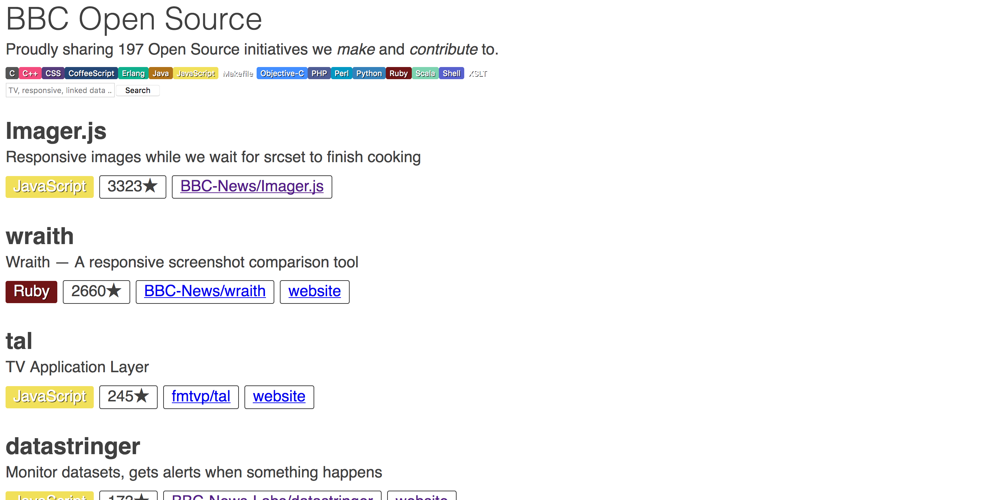

# bbc.github.io

> An index of all BBC public repositories on GitHub.

It scans for public repositories owned by a trusted list of BBC organisations on GitHub.

Are filtered out:

- repositories with an empty description
- *.github.io repositories

# Install

    npm install
    npm run update

Dependencies and fresh data will be pulled into the project workspace.

# Development

    npm run build
    open dist/index.html

Applications assets will be compiled and assembled only once.

    npm run watch

Application assets will be compiled as soon as you modify them.

# Deploy

    npm run deploy

Content will be pushed on [GitHub Pages](https://pages.github.com/).
